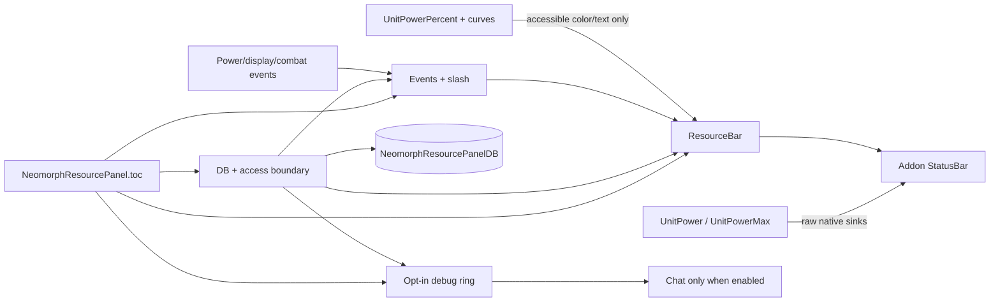

# Neomorph Resource Panel code graph

```mermaid
flowchart LR
  TOC["NeomorphResourcePanel.toc"] --> DB["DB + access boundary"]
  TOC --> Debug["Opt-in debug ring"]
  TOC --> Bar["ResourceBar"]
  TOC --> Init["Events + slash"]

  DB --> SV[("NeomorphResourcePanelDB")]
  DB --> Debug
  DB --> Bar
  DB --> Init

  Events["Power/display/combat events"] --> Init
  Init --> Bar
  Power["UnitPower / UnitPowerMax"] -->|"raw native sinks"| Status["Addon StatusBar"]
  Percent["UnitPowerPercent + curves"] -->|"accessible color/text only"| Bar
  Bar --> Status
  Debug --> Chat["Chat only when enabled"]
```
