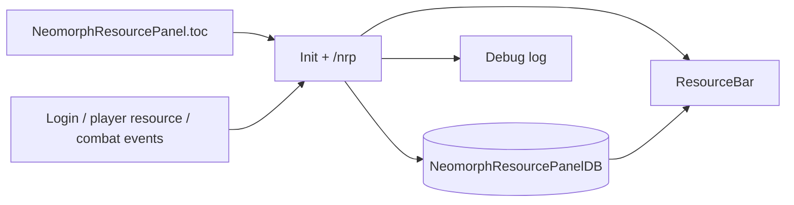

# Code graph

```mermaid
flowchart LR
  TOC["NeomorphResourcePanel.toc"] --> Init["Init + /nrp"]
  Init --> DB[("NeomorphResourcePanelDB")]
  Init --> Bar["ResourceBar"]
  DB --> Bar
  Events["Login / player resource / combat events"] --> Init
  Init --> Debug["Debug log"]
```
